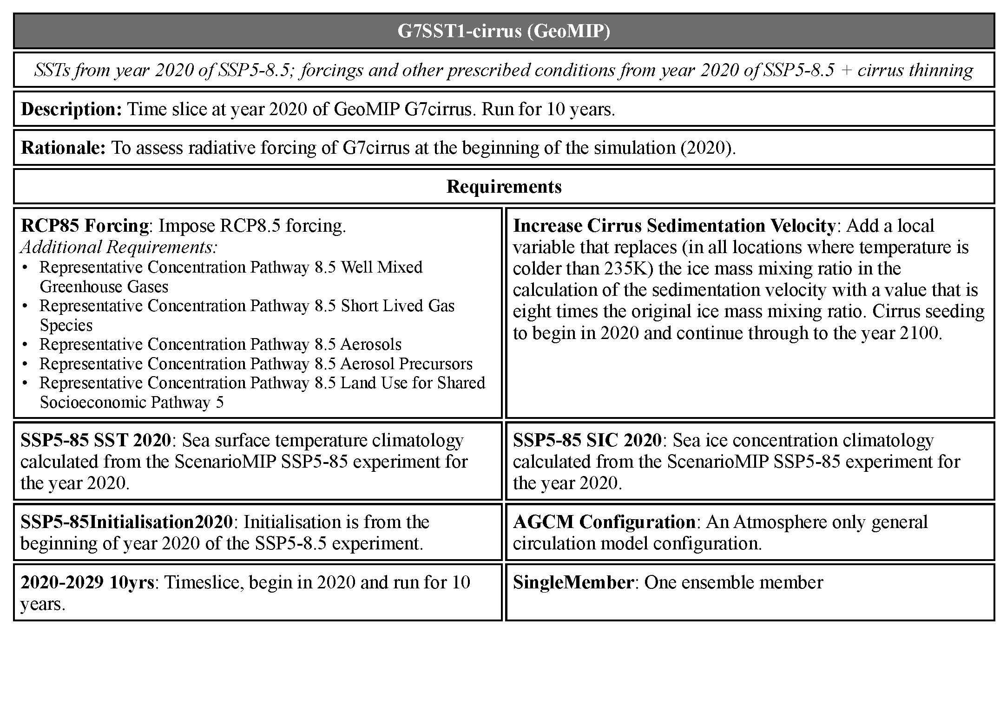

# esdoc4scientists

Repository of tools for manipulating information held in an ESDOC repository to make tables for scientific publications.

Contributions welcome, please generate a pull request if you have some more examples to add.

#### Version 1

(Python 2.7 only, Python 3 version due late summer 2019.)

The initial release will be a tool for extracting **_Experiment_** and **_MIP_** documents from an ESDOC repository and making a PDF table which is suitable for inclusion into a journal paper (i.e. the table is typeset into PDF and the paper will need to include the PDF as a graphic). In most cases the PDF output of the python code will need to be cropped using a tool such as [pdfcropmargins](https://github.com/abarker/pdfCropMargins) (there are also a bunch of online services that do the same thing).

Dependencies:

* [pyesdoc](https://pypi.org/project/pyesdoc/) - which is pip installable.
* [jinja2](http://jinja.pocoo.org/docs/2.10/intro/#installation) - also pip installable.
* [weasyprint]() - you'll need the python2 version, which is pip installable:    
	`pip install weasyprint==0.42.3`
* Unfortunately there is also a dependency on system gtk librararies, which may or may not be a problem for some. How I got it to work with MacOS is [documented in the code](https://github.com/bnlawrence/esdoc4scientists/blob/ad64f25f111ff7f7a3b6d1de3d96ebe6a89eaeb0/experiment.py#L12).

All the code in this version is in one script, and you can see several instances of how to use it in the test cases, which cover

1. For _Experiment_  or _MIP_ documents, outputting a one or two column table, and
2. Creating a table which describes CMIP6.

An example[1](#fn1) of the first is: 

#### Changing the Layout and Developing New Capability

Users who want to change the layout of the tables, or develop new tables will need to try and understand  _pyesdoc_ which does the heavy lifting via Python class instances for manipulating ESDOC documents. 

* The documentation for _pyesdoc_ itself is rather sparse right now, but you can't go too far wrong by just playing at the console and using introspection. 
* You can also inspect the attributes and structure by looking at the [canonical schema description](https://github.com/ES-DOC/esdoc-cim-v2-schema). For example [this code](https://github.com/ES-DOC/esdoc-cim-v2-schema/blob/bdf6e8268da0e0ba7f7bc3252644042fc79c3434/designing_classes.py#L173) is the definition of an _Experiment_ and you can see the attributes which an Experiment instance must have.
* A key concept you will need to deal with is that the documents are all linked together. As you navigate around them pythonically you will get the title and uid and types of other documents in links (e.g. the Experiment references _Requirements_), and sometimes you will need to pull the full description of those via the UID. Code to do this is included. Note how the additional requirements [are found](https://github.com/bnlawrence/esdoc4scientists/blob/ad64f25f111ff7f7a3b6d1de3d96ebe6a89eaeb0/experiment.py#L226) for the example above.
*  If you get some new things working please contribute them back here!

#### Acknowledgements

This would not have been possible without some initial help from [Mark Greenslade](https://github.com/momipsl), the author of pyesdoc.

<a name="fn1">[1]</a>:  Note that this is a poor quality jpg rendering of the [actual pdf](expected_output/double_cropped.pdf) in the repository. The workflow for this was to crop the [original pdf](expected_output/double.pdf) output using pdf-crop-margins, then convert to jpg using an [online converter](http://convert-my-image.com/PdfToJpg) (my usual goto for this sort of work, ImageMagick, didn't like the grayscale).

